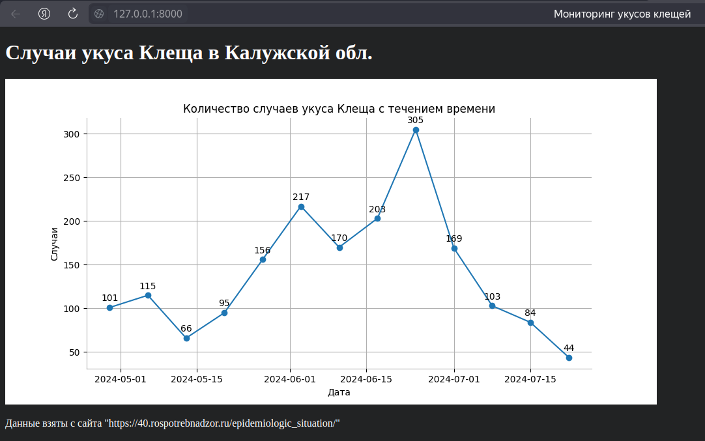
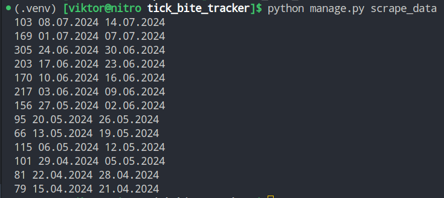

rospotrebnadzor - Санитарно-эпидемиологическая обстановка - Калужская обл. (rpn-seo-k)

Проект "Клещевые болезни в Калужской области: анализ данных и создание графика"

| Django           | Matplotlib       |
|------------------|------------------|

Описание проекта: Проект, разработанный на Python с использованием фреймворка Django, который осуществляет парсинг статей на сайте Роспотребнадзора и анализирует информацию о ситуации по иксодовому клещевому боррелиозу и другим заболеваниям, передающимся при укусе клещами, в Калужской области за определенный период. Проект извлекает данные о количестве людей, обратившихся в медицинские организации с вопросами, связанными с укусами клещей, и создает график, который можно просмотреть в браузере.

Цель проекта: Изучение и визуализация статистических данных о случаях укусов клещей и обращений в медицинские организации в Калужской области с целью повышения осведомленности и информирования общественности о данной проблеме.

С помощью команды мы парсим информацию и добавляем её в базу данных
`python manage.py scrape_data` 

Так же во время сбора информации видим данные и даты

Пример даных с сайта, которые мы парсим.

